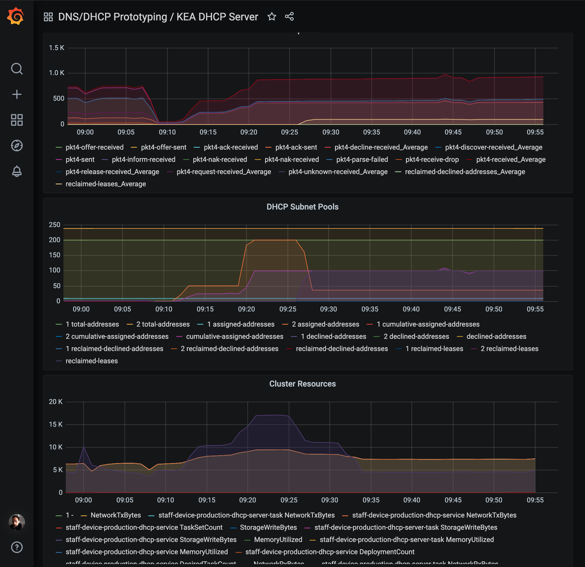

# DHCP Docker Image

This repository contains the Dockerfile to create the [ISC Kea](https://www.isc.org/kea/) DHCP server docker image.

This image is published to [Amazon ECR](https://aws.amazon.com/ecr/).

## ISC Kea version

At the time of writing, the stable release for ISC Kea is [version 1.8.x](https://cloudsmith.io/~isc/repos/kea-1-8/packages/).

## ISC Kea High Availability

Kea is configured to run in [hot-standby mode](https://kea.readthedocs.io/en/kea-1.8.1/arm/hooks.html#hot-standby-configuration). Discussion of the implementation can be found [here](./documentation/high-availability.md).

## Performance Testing

Results of the KEA [performance test](documentation/performance_metrics.md).

## Getting started

To get started with development you will need:

- [Docker](https://www.docker.com/)
- [Docker Compose](https://docs.docker.com/compose/)

### Authenticating Docker with AWS ECR

The Docker base image is stored in ECR. Prior to building the container you must authenticate Docker to the ECR registry. [Details can be found here](https://docs.aws.amazon.com/AmazonECR/latest/userguide/Registries.html#registry_auth).

If you have [aws-vault](https://github.com/99designs/aws-vault#installing) configured with credentials for shared services, do the following to authenticate:

```bash
aws-vault exec <SHARED_SERVICES_VAULT_PROFILE_NAME> -- aws ecr get-login-password --region eu-west-2 | docker login --username AWS --password-stdin <SHARED_SERVICES_ACCOUNT_ID>.dkr.ecr.eu-west-2.amazonaws.com
```
Replace `<SHARED_SERVICES_VAULT_PROFILE_NAME>` and `<SHARED_SERVICES_ACCOUNT_ID>` in the command above with the profile name and ID of the shared services account configured in aws-vault.

### Running Locally

See the target `run` in the [Makefile](./Makefile)

### Deploying to Production

Deployments are automated in the CI pipeline. See [buildspec.yml](./buildspec.yml)

## Automated Testing

To run the tests locally run

```bash
$ make test
```

This will first clear out any leases in the local database. `perfdhcp` is used to emulate a number of clients and multiple [DORA](https://en.wikipedia.org/wiki/Dynamic_Host_Configuration_Protocol#Operation) cycles. The number of created leases is checked to ensure the server is operating as expected. The [dhcp_test.sh](./dhcp_test.sh) script will exit with a non zero code if the expected number of leases were not created.

## Container Health Checks

To ensure that an invalid task does not get into the production ECS cluster, a bootstrap script has been written. This uses `perfdhcp` to ensure that an IP can be leased. If this fails, a notification will be sent to the SNS critical notification topic and forwarded to subscribers. This check is not performed locally.

## Manual Testing

- Run `ifconfig` to find the name for the docker-compose network interface.
- Run
  `sudo nmap --script broadcast-dhcp-discover -e <NETWORK_INTERFACE>`

  - The DHCP server should respond with an offer, e.g:

  ```bash
    Starting Nmap 7.80 ( https://nmap.org ) at 2020-07-28 14:53 BST
    Pre-scan script results:
    | broadcast-dhcp-discover:
    |   Response 1 of 1:
    |     IP Offered: 192.0.2.10
    |     DHCP Message Type: DHCPOFFER
    |     Subnet Mask: 255.255.255.0
    |     IP Address Lease Time: 1h06m40s
    |_    Server Identifier: 172.29.0.4
    WARNING: No targets were specified, so 0 hosts scanned.
    Nmap done: 0 IP addresses (0 hosts up) scanned in 0.53 seconds
  ```

## Monitoring

Metrics for the Kea servers are displayed in the [IMA Grafana dashboard](https://github.com/ministryofjustice/staff-infrastructure-monitoring-config/blob/main/integrations/staff-device-dns-dhcp-infrastructure/dashboards/dhcp/dhcp_template.json).
The JSON configuration file for the dashboard is stored in this repo, when updates are made, the JSON needs to be saved and tracked with version control.

The metrics categories are:

  - AWS Service metrics
  - Kea Network metrics
  - Kea Subnet metrics



## Considerations

Kea currently does not support connecting to the database over SSL. See [kea#15](https://github.com/isc-projects/kea/pull/15)
