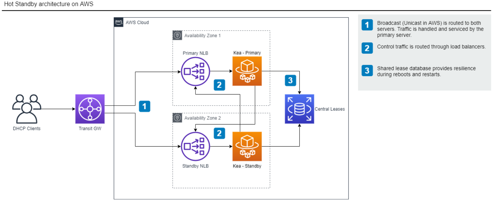

# Kea High Availability

Kea does not support cloud native elastic scaling. The documented, [supported configurations](https://kea.readthedocs.io/en/latest/arm/hooks.html#supported-configurations) are hot-standby, load-balancing and passive backup.

Kea is configured to run in [hot-standby mode](https://kea.readthedocs.io/en/kea-1.8.1/arm/hooks.html#hot-standby-configuration) in conjunction with a MySQL shared lease database run in [AWS RDS](https://aws.amazon.com/rds/).

[Image Source](images/kea-ha.drawio)
