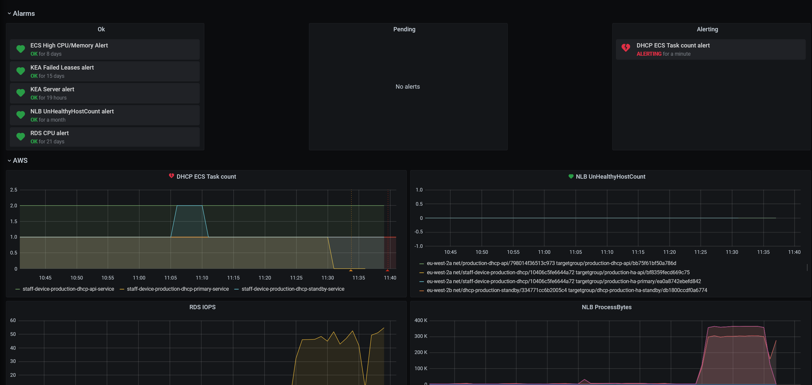

# KEA DHCP High Availability Testing

This document details the results of the Kea HA testing, carried out on the 9th of February 2021.

## Configuration

- [Kea DHCP V1.8.2](https://github.com/ministryofjustice/staff-device-dhcp-server/blob/main/dhcp-service/Dockerfile) was the subject under test.
- Hosted on [AWS Fargate](https://aws.amazon.com/fargate/) with 4GB Memory and 1GB CPU available
- The load testing tool is [perfdhcp](#PerfDHCP).
- Multi-Threading is enabled, the server can concurrently process 12 concurrent threads with up to 65 queued packets per thread.
- High Availability is configured for Kea to run in [hot-standby mode](https://kea.readthedocs.io/en/kea-1.8.2/arm/hooks.html#hot-standby-configuration), using a Primary and Standby server
- Kea is configured to use a shared AWS RDS MySQL lease backend. Sized at [db.t2.large](https://aws.amazon.com/rds/instance-types/)
- The production configuration file has been loaded and contains the following:
  - 142 Sites
  - 829 Subnets
  - 14404 reservations
  - At least two client classes per subnet

## Test Strategy

- Tests are run from a remote site in the Corsham DC. The host is integrated through an AWS Transit Gateway to the DHCP service.
- To enable observation of each server's behaviour, two clients will be run. One pointing to the primary server and one at the standby server.
- A request is considered the entire DORA DHCP request exchange
- The perfdhcp testing tool occasionally exits before the last response packet is delivered, skewing the results by 1. This does not affect the findings of this test and was taken into consideration.

## Test Command

[Perfdhcp version 1.8.1](https://kea.readthedocs.io/en/latest/man/perfdhcp.8.html) was used for performance testing. 

The drop rate was manually observed to monitor when the primary server stopped serving leases and when the standby server took over and started serving leases.

The following command was run from the remote site in Corsham.

```sh
perfdhcp $DHCP_SERVICE_IP -n 100 -r 10 -R 100 -d 3 -W 3
```

The drop time is set to 3 seconds with the `-d` flag, any request taking more than 3 seconds is considered a failed request.

## High-Availability Configuration

Test were run with the following __default__ HA [hot-standby configuration values]((https://kea.readthedocs.io/en/kea-1.8.2/arm/hooks.html#hot-standby-configuration)):

```bash
heartbeat-interval  : 10000 
max-response-delay  : 60000 
max-ack-delay       : 10000
max-unacked-message : 10000
```

## Results

To simulate the loss of a primary server, the appropriate ECS tasks desired count, min and max were set to 0. It should be noted that the server / task removal is not instant.

### Key Event Timings

| Event Description            | Time     | Time Elapsed |
|------------------------------|----------|--------------|
|Primary server taken down     | 11:30:15 | -            |
|Primary stops serving leases  | 11:36:06 | 5m 51s       |
|Standby starts serving leases | 11:36:57 | 0m 51s       |
|Primary is re-enabled         | 11:41:57 | 5m 0s        |
|Primary resumes serving leases| 11:44:07 | 2m 10s       |

### Result Log Files

Log files were recorded for each of the perfdhcp test clients. Note that the IP addresses have been redacted.

- [Primary Server perfdhcp log](./primary-results.txt)
- [Standby Server perfdhcp log](./standby-results.txt)

### DHCP Monitoring in IMA

The IMA dashboard for DHCP monitors the ECS task instance count along with other metrics. When the primary server was taken down (instance count of less than 1):

- The __DHCP ECS task count__ panel changed to reflect the transition.
- An alert was raised in the __Alerting__ panel.

#### IMA DHCP Monitor Dashboard


