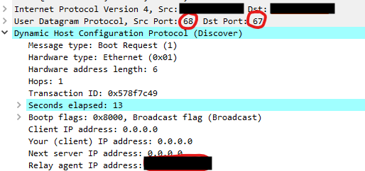

# Edward House Go-Live - Non standard DHCP ports
Date: 2021-06-23

## What happened
On changing the IP helpers at Edward House, devices could not lease IP addresses.

## How was the issue diagnosed
Packet captures were run on the Palo Alto firewalls in ARK for both a live working site (Cygnet Park) and Edward House in order to compare differences.

On inspection of the packets, the switch (DHCP relay) at Cygnet Park was found to be sending DISCOVER to port 67 on the DHCP server. Further inspection of the packet payload showed the source port to be 67 and the destination port to be 67.



Inspection of the Edward House packet capture also showed packets sent to port 67 on the DHCP server, however, inspection of the packet
payload showed the source port to be port 68 and the destination to be port 67.


### From the Kea documentation:

```
Generalized UDP Source Port for DHCP Relay, [RFC 8357](https://tools.ietf.org/html/rfc8357): The Kea server is able to handle Relay Agent Information Source Port suboption in a received message, remembers the UDP port and sends back reply to the same relay agent using this UDP port.
```

Source: [Kea Documentation](https://kea.readthedocs.io/en/latest/arm/dhcp4-srv.html)

### From the RFC 8357 documentation:

```
When a relay agent uses a non-DHCP UDP port (not 67) to communicate with the DHCP server, it MUST include the "Source Port Sub-option" in Relay-forward messages to indicate that.
```

Source: [RFC 8357](https://tools.ietf.org/html/rfc8357)

In Cygnet Park DISCOVER packets are sent on a non standard source port, and the source port sub option is set correctly. In Edward House however, DISCOVER packets are sent on a none standard source port, but do not set the source port sub option. This causes the DHCP server to function incorrectly.

The major difference noted between Cygnet Park and Edward House is the switching hardware. The Edward House hardware specifically complies with RFC 2131 and RFC 3046.

### From the documentation of DHCP Relay implementation for the Edward Hous switch:

```
To apply DHCP Option 82, the routing switch must operate in conjunction with a server that supports Option 82. (DHCP servers that do not support Option 82 typically ignore Option 82 fields.)
```

Source: [HP Documentation](https://techhub.hpe.com/eginfolib/networking/docs/switches/RA/15-18/5998-8165_ra_2620_mrg/content/ch03s09.html)

### From the Kea documentation:


```
Kea also supports Relay Agent Information (RAI) option, sometimes referred to as relay option, agent option or simply option 82. The option itself is just a container and doesn’t convey any information on its own.
```
Source: [Kea Documentation](https://kea.readthedocs.io/en/latest/arm/dhcp4-srv.html)

## How was the issue resolved
By setting the option 82 on the DISCOVER packets on the Edward House DHCP relay.

## How can the issue be prevented from happening again
By setting the option 82 on the DISCOVER packets on the switch DHCP relay if the switch does not support [RFC 8357](https://tools.ietf.org/html/rfc8357)


** This is a work in progress. Outcome of the fix has not yet been tested.
