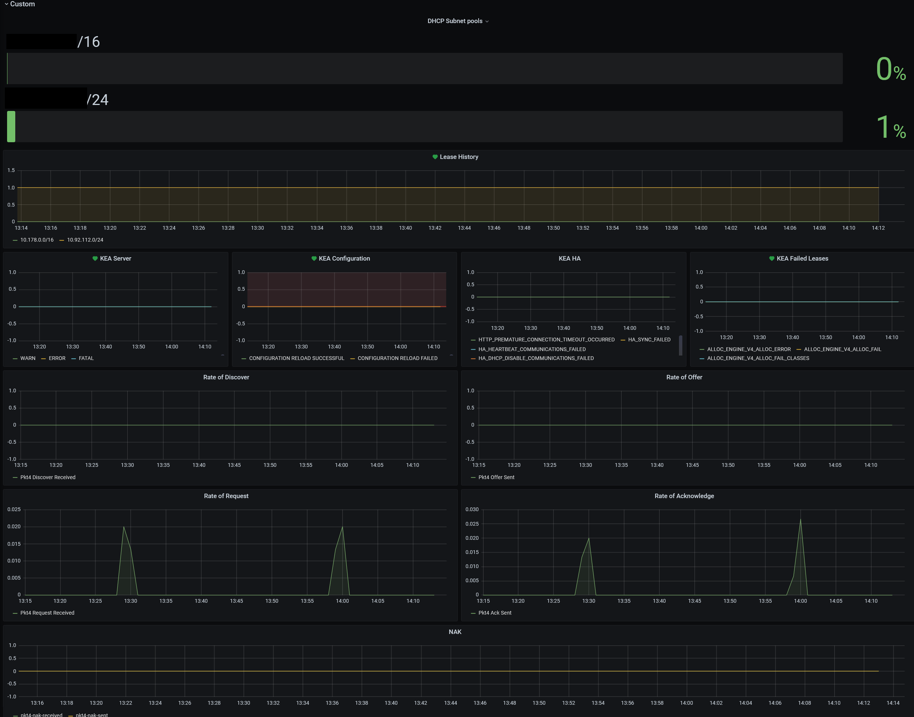

# Monitoring

DHCP uses Grafana to display metrics. The Grafana dashboard can be found [here](https://monitoring-alerting.staff.service.justice.gov.uk/d/cEwjsH1Gk/kea-dhcp-metrics?orgId=1&refresh=1m).

The JSON used to configure the dashboard is stored in the  [IMA Grafana dashboard configuration repo](https://github.com/ministryofjustice/staff-infrastructure-monitoring-config/blob/main/integrations/staff-device-dns-dhcp-infrastructure/dashboards/dhcp/dhcp_template.json). When updates are made in the dashboard, the JSON needs to be saved and tracked with version control. More information around this can be found in the documentation in the IMA repo.

The DHCP dashboard is separated into four sections:

- Alarms
- AWS Service metrics
- Kea Network metrics
- Kea Subnet metrics

## Alarms

The alarms section summarizes the state of the system and categorizes them as OK, Pending or Alerting.

- `OK` is a sign that the system is operating normally
- `Pending` indicates that the system may be either recovering or erroring
- `Alerting` shows that the system needs attention

## AWS Metrics

This section displays all the relevant AWS metrics. These include:

- [ECS Task Count](https://docs.aws.amazon.com/AmazonECS/latest/developerguide/cloudwatch-metrics.html)
- [NLB ProccessBytes](https://docs.aws.amazon.com/elasticloadbalancing/latest/network/load-balancer-cloudwatch-metrics.html)
- [UnHealthyHostCount](https://docs.aws.amazon.com/elasticloadbalancing/latest/classic/elb-cloudwatch-metrics.html)
- [ECS MemoryUtilization and CPUUtilization](https://docs.aws.amazon.com/AmazonECS/latest/developerguide/cloudwatch-metrics.html)
- [RDS ReadIOPS, WriteIOPS and CPUUtilization](https://docs.aws.amazon.com/AmazonRDS/latest/UserGuide/CHAP_Storage.html#Concepts.Storage.Metrics)

## Custom DHCP Metrics

The custom section displays all DHCP metrics outputted by [Kea](https://cloudsmith.io/~isc/repos/kea-1-8/packages/) as well as a subset of [error and debug messages](https://kea.readthedocs.io/en/kea-1.8.0/kea-messages.html).

- CONFIGURATION RELOAD SUCCESSFUL
- CONFIGURATION RELOAD FAILED
- ALLOC_ENGINE_V4_ALLOC_ERROR
- ALLOC_ENGINE_V4_ALLOC_FAIL
- ALLOC_ENGINE_V4_ALLOC_FAIL_CLASSES

The dashboards monitor [subnet and network metrics](https://kea.readthedocs.io/en/kea-1.8.1/arm/stats.html) including the rate of change of DORA operations (Discovery, Offer, Request and Acknowledge).
