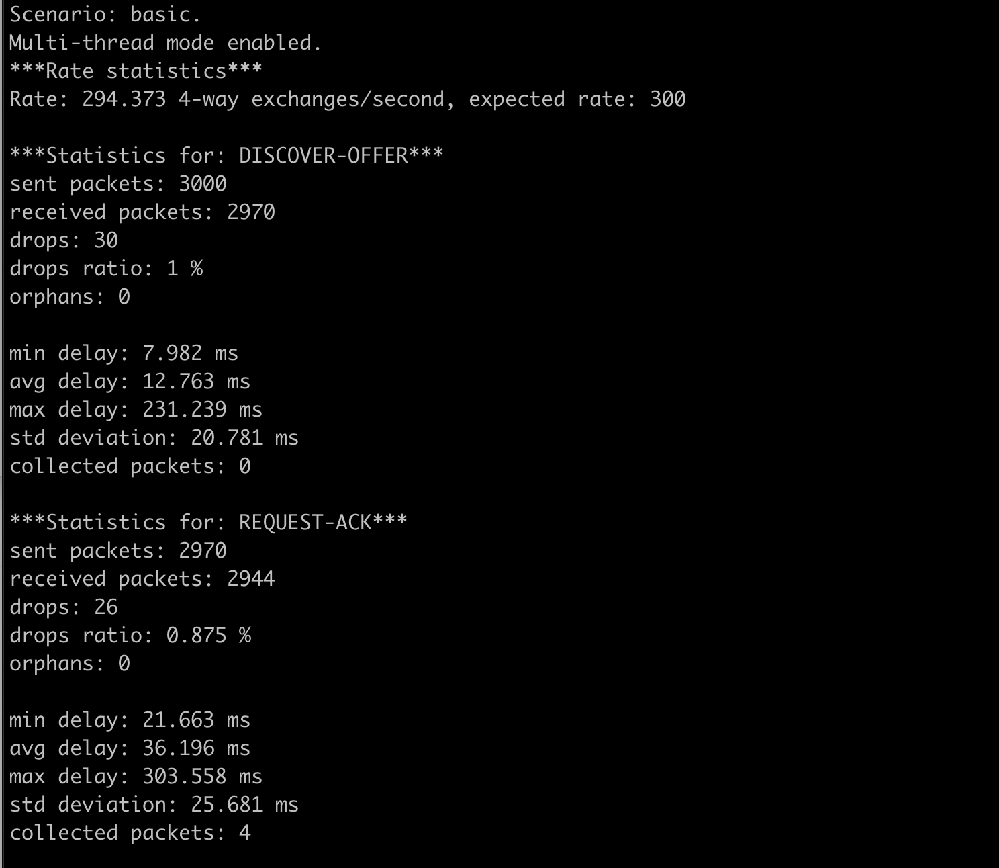
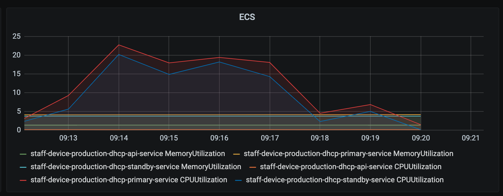
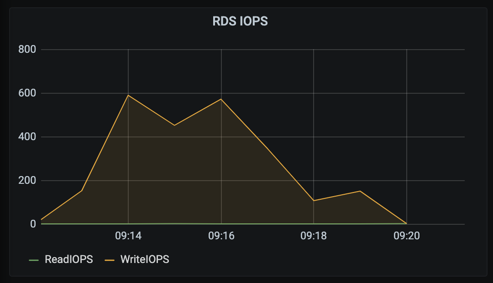
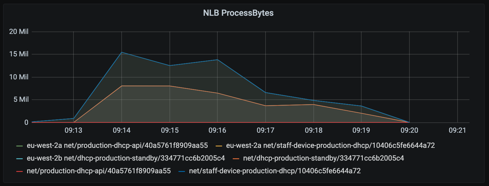

# KEA DHCP Performance testing

This documentation contains the results of the load test conducted on the 20th of January 2021.
- [Kea DHCP V1.8](https://github.com/ministryofjustice/staff-device-dhcp-server/blob/main/dhcp-service/Dockerfile) was the subject under test
- Hosted on [AWS infrastructure](https://github.com/ministryofjustice/staff-device-dns-dhcp-infrastructure).
- The load testing tool that was used is [perfdhcp](#PerfDHCP).

## Configuration

- Multi-Threading is enabled, the server can concurrently process 12 concurrent threads with up to 65 queued packets per thread
- High Availability is configuration for Kea to run in [hot-standby mode](https://gitlab.isc.org/isc-projects/kea/-/wikis/designs/High-Availability-Design), using a Primary and Standby server
- Kea runs on ECS Fargate and has 4GB Memory and 1GB CPU available
- Kea is configured to use a shared AWS RDS MySQL lease backend. Sized at [db.t2.large](https://aws.amazon.com/rds/instance-types/)
- The production configuration file has been loaded and contains the following:
  - 142 Sites
  - 829 Subnets
  - 14404 reservations
  - At least two client classes per subnet

## Considerations

- Tests are run from a remote site in the Corsham DC, which is integrated through an AWS Transit Gateway to the DHCP service. This may introduce network latency
- A request is considered the entire DORA DHCP request exchange
- 10 tests were run, the highest and lowest results were eliminated and the remaining average was used
- The Kea configuration file is checked, in an S3 bucket, every 5 minutes. It is compared to the current configuration and is loaded when changes are detected. This operation has no discernable impact on performance.
- Kea publishes custom metrics to AWS CloudWatch every 10 seconds. Resource usage for this is minimal and not visible on the metrics below. 
- The perfdhcp testing tool occasionally exits before the last response packet is delivered, skewing the results by 1. This does not affect the findings of this test and was taken into consideration.
- A drop ratio of > 1% is considered a failed test
- At the time of writing, volumetrics for the existing DHCP servers are not available. Therefore it is not possible to compare existing load with the new service.

## Test Command

[Perfdhcp version 1.8.1](https://kea.readthedocs.io/en/latest/man/perfdhcp.8.html) was used for performance testing.

The drop rate was manually observed to establish the health threshold.

The following command was run from the remote site in Corsham.

```sh
perfdhcp -4 $DHCP_SERVICE_IP -n3000 -r300 -R 5000000 -d3
```

The drop time is set to 3 seconds with the `-d` flag, any request taking more than 3 seconds is considered a failed request.

## Load test results - 20th January 2021

The test results indicate that the current Kea configuration can service **approximately 300 leases per second**. This test was performed multiple times and the results were observed to be consistent.

### Hypothetical usage scenario

If 20k devices were to use the service in a working day (8 hours), with a lease time of 1 day, it would result in 0.7 lease requests per second.
This number only applies when traffic is spread evenly over an 8 hour working day and it is understood that there will be peaks and dips in traffic throughout the day.

```
20000 / 8 / 60 / 60 = 0.69
```



### DORA


### ECS - Elastic Container Service



### RDS - Relational Database Service




### NLB - Network Load Balancer



## How to run these tests

To gain access to the remote test site, please see [Corsham Testing](https://github.com/ministryofjustice/staff-device-dns-dhcp-infrastructure/blob/main/documentation/corsham-test.md).


Changing instance size did not increase upper bound
How many devices can be supported
