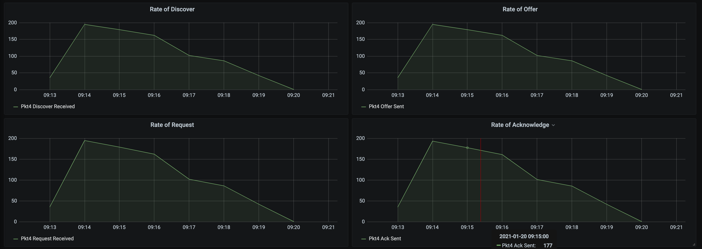

# KEA DHCP Performance testing

This documentation contains the results of the load test conducted on the 8th of January 2021. 
[Kea DHCP V1.8](https://github.com/ministryofjustice/staff-device-dhcp-server/blob/main/dhcp-service/Dockerfile) was the subject under test which is hosted on [AWS infrastructure](https://github.com/ministryofjustice/staff-device-dns-dhcp-infrastructure). The load testing tool that was used is [perfdhcp](#PerfDHCP).

## Current Configuration

- Multi-Threading is enabled on the KEA servers
- High Availibility configuration for KEA to run in [hot-standby mode](https://gitlab.isc.org/isc-projects/kea/-/wikis/designs/High-Availability-Design), with a Primary and Standby server
- KEA runs on ECS Fargate and has 2GB Memory and 1GB CPU available
- MYSQL lease backend. Running as a [db.t2.large](https://aws.amazon.com/rds/instance-types/) AWS RDS instance
- Production configuration file has been loaded and contains the following:
  - 142 Sites
  - 829 Subnets
  - 14404 reservations
  - At least two client classes per subnet

## Considerations

- Tests are run from a remote site in Corsham, this may introduce network latency
- A lease request is considered the entire DORA DHCP flow
- 10 tests were run, the highest and lowest results were eliminated and the remaining average was used
- The KEA configuration file is pulled from an S3 bucket every 5 minutes. It is compared to the current configuration and is loaded if any changes were detected. This seems to not impact performance.
- KEA publishes custom metrics to CloudWatch every 10 seconds, resource usage for this is minimal and not visible on the metrics below. 
- The perfdhcp testing tool sometimes exits before the last response packet is delivered, skewing the results by 1. This does not affect the findings of this test and was taken into consideration.

## Test Command

[Perfdhcp version 1.8.1](https://kea.readthedocs.io/en/latest/man/perfdhcp.8.html) was used to do the performance test.

It rapidly ramps up traffic in increments of 10 requests per second.
The drop rate was manually observed to establish the capabilities of the server.

The following command was run from a remote site in Corsham.

```sh
perfdhcp -4 $DHCP_SERVICE_IP -r10 -R 5000 -W3 -t1 -d3
```

The drop time is set to 3 seconds with the `-d` flag, any requests taking more than 3 seconds is considered a failed request.

## Load test results - 8th January 2021

The test results shows that KEA can handle approximately 256 requests per second. This test was run multiple times and the results were consistent.

### Hypothetical usage scenario

If 20k devices were to use this service in a working day (8 hours), with a lease time of 1 day, it would result in 0.7 lease requests per second.
This number only applies when traffic is spread evenly over the 8 hours and it is understood that there will be peaks and dips in traffic throughout the day.

At the time of writing, there are no volumetrics for the existing DHCP servers, which means it's not possible to compare this directly to the new service.

```
20000 / 8 / 60 / 60 = 0.69
```


### DORA



### ECS - Elastic Container Service


### RDS - Relational Database Service


### NLB - Network Load Balancer


## How to run these tests

To gain access to the remote test site, please see [Corsham Testing](https://github.com/ministryofjustice/staff-device-dns-dhcp-infrastructure/blob/main/documentation/corsham-test.md).


Changing instance size did not increase upper bound
How many devices can be supported
